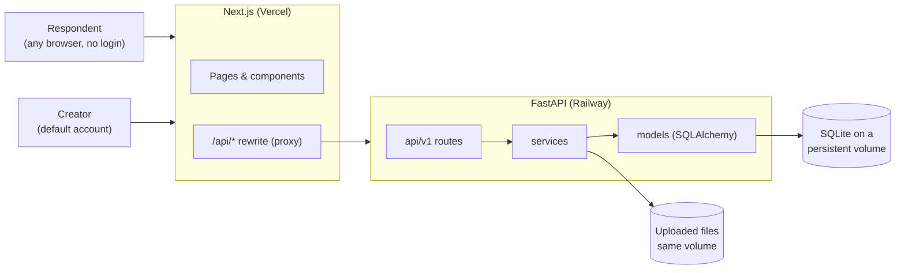
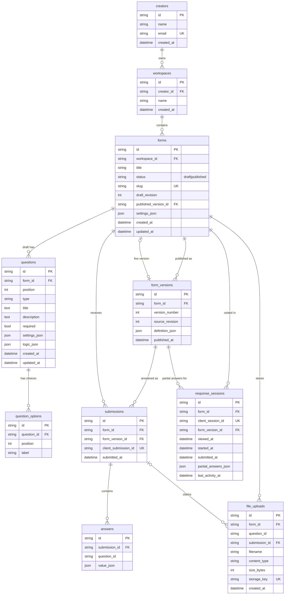

# Formflow: a Typeform clone

A full-stack clone of Typeform: build forms with a drag-and-drop builder, publish them as a shareable link,
collect answers through the one-question-at-a-time conversational flow, and analyse the results.

- **Live demo:** <https://typeform-scaler.vercel.app> (API: <https://backend-production-4bd9.up.railway.app/docs>)
- **Stack:** Next.js 16 (TypeScript) · FastAPI (Python) · SQLite · SQLAlchemy 2 · Alembic
- **Tests:** 51 backend tests (pytest) and 46 end-to-end browser tests (Playwright), one per feature

---

## Contents

1. [Features](#features)
2. [Tech stack](#tech-stack)
3. [Running it locally (Windows / PowerShell)](#running-it-locally-windows--powershell)
4. [Architecture](#architecture)
5. [Database schema](#database-schema)
6. [API overview](#api-overview)
7. [Testing](#testing)
8. [Deployment](#deployment)
9. [Design decisions](#design-decisions)
10. [Assumptions](#assumptions)
11. [Known limitations and future work](#known-limitations-and-future-work)

---

## Features

### Core

| Area | What you can do |
|---|---|
| **Workspace** | List of forms with status (draft / live) and response counts; list and grid views; search; sort; create, rename, duplicate, delete (with confirmation), publish / unpublish, copy link |
| **Builder** | Three panels like Typeform: sortable question list (drag-and-drop or keyboard), a canvas that is a live preview of the question with inline editing, and a settings panel per question type. Question picker modal, desktop/mobile preview toggle, autosave with a "Saving… / All changes saved" indicator |
| **Question types** | Short text, long text, multiple choice (single or multiple), dropdown (type to filter), email, number (min/max), yes/no, rating (3–10 stars), and file upload |
| **Per-question settings** | Required, description/help text, placeholder, max characters, min/max, multiple selection, rating steps, file size limit |
| **Publishing** | Publishing freezes an immutable version; the share link (`/to/<slug>`) stays the same across republishes; edits stay private until "Publish changes" |
| **Respondent flow** | Full-screen, one question at a time with direction-aware animated transitions; progress bar and "x of n answered"; keyboard: Enter / ↓ next, ↑ back, letter keys for choices, Y/N, number keys for ratings, Shift+Enter for new lines; single-choice answers auto-advance; welcome and thank-you screens; no login |
| **Validation** | Same rules and messages in the browser (instant) and on the server (authoritative): required, email format, numbers and ranges, valid choices, rating bounds, max length |
| **Results** | Views, starts, submissions and completion rate; responses over the last 14 days; per-question summaries (choice bars, rating average and distribution, number average/min/max, recent text answers); paginated responses table; full single response in a side panel; partial responses |
| **Typeform touches** | Toasts, modals, inline editing, theme gallery, editable thank-you screen, "coming soon" placeholders for Typeform areas that are out of scope (Contacts, Automations, Integrations, Brand kit, AI, templates, payments…) |

### Bonus (all implemented)

- **Logic jumps:** "If the answer is / is not / is greater than / is lower than X, go to question Y or the end". The server re-walks the respondent's path, so questions a jump skipped are never required.
- **Custom themes:** 4 presets (Classic, Lavender, Ocean, Midnight), each with its own colours, background and font.
- **CSV export** of all responses.
- **Partial responses and completion rate:** unfinished answers are autosaved and listed separately.
- **File upload question** with a size limit; files download from the results.
- **Dark mode** for the creator app (Light / Dark / System). Public forms keep their own form theme.

### Seed data

On first start the backend seeds one creator and three forms:

| Form | Status | Highlights |
|---|---|---|
| Event Registration | Live, 24 responses | Text, email, dropdown, multi-select, yes/no with a logic jump, rating |
| Product Feedback | Live, 18 responses | Lavender theme, rating, choice, long text, number 0–10, optional email |
| Job Application | Draft | Ocean theme, welcome screen, number, dropdown, long text, CV upload |

Each live form also has views, starts and partial responses, so the results look realistic straight away.

---

## Tech stack

| Layer | Choice | Why |
|---|---|---|
| Frontend | **Next.js 16** (App Router, TypeScript strict) | Required by the brief; file-based routing for `/workspace`, `/forms/[id]/edit`, `/to/[slug]`… |
| Styling | **Tailwind CSS 4** + design tokens in CSS variables | Typeform's look is mostly spacing, colour and type; tokens also give dark mode for free |
| UI primitives | **Radix UI** (dialog, dropdown menu, popover, switch) | Accessible behaviour (focus trap, keyboard, ARIA) without imposing a look |
| Drag and drop | **dnd-kit** | Sortable lists with mouse, touch and keyboard support |
| Animation | **Motion** (`motion/react`) | Enter/exit transitions between questions, reduced-motion aware |
| Builder state | **Zustand** | Small store with plain functions; easy to reason about autosave |
| Charts / toasts / icons | Recharts · Sonner · Lucide | |
| Backend | **FastAPI** + **Pydantic v2** | Typed request/response models, automatic OpenAPI docs at `/docs` |
| Database | **SQLite** via **SQLAlchemy 2** + **Alembic** migrations | Required by the brief; foreign keys enforced with `PRAGMA foreign_keys=ON` |
| Tests | pytest · Playwright | |

---

## Running it locally (Windows / PowerShell)

Prerequisites: **Python 3.13** (`py -3.13`), **Node.js 20+**, Git. Google Chrome is only needed for the end-to-end tests.

### 1. Backend (FastAPI on port 8000)

```powershell
cd backend
py -3.13 -m venv .venv
.\.venv\Scripts\Activate.ps1
python -m pip install -r requirements-dev.txt
python -m alembic upgrade head          # creates data\app.db
python -m uvicorn app.main:app --reload --port 8000
```

Demo data is seeded automatically when the database is empty. API docs: <http://127.0.0.1:8000/docs>.

To start over with fresh demo data: `python -m scripts.seed --reset`.

### 2. Frontend (Next.js on port 3000)

```powershell
cd frontend
npm install
npm run dev
```

Open <http://localhost:3000>. The frontend proxies every `/api/*` request to the backend, so no CORS setup is needed.

### Environment variables

Both apps work with no configuration. To change the defaults, copy `.env.example` to `.env` (backend)
or `.env.local` (frontend).

| App | Variable | Default | Purpose |
|---|---|---|---|
| backend | `DATABASE_URL` | `sqlite:///<backend>/data/app.db` | SQLite file |
| backend | `UPLOAD_DIR` | `<backend>/data/uploads` | Where uploaded files are stored |
| backend | `CORS_ORIGINS` | `http://localhost:3000` | Origins allowed to call the API directly |
| backend | `SEED_ON_EMPTY` | `true` | Seed demo data on first start |
| frontend | `BACKEND_URL` | `http://127.0.0.1:8000` | Where Next.js proxies `/api/*` |

---

## Architecture



- **One origin for the browser.** The browser only talks to Next.js. `next.config.ts` rewrites `/api/*` to FastAPI,
  so there is no CORS in production and no backend URL baked into the client.
- **Backend layers.** `api/v1/*` (thin HTTP routes) → `services/*` (business logic and transactions) →
  `models/*` (SQLAlchemy). Pydantic schemas (`schemas/*`) sit at the HTTP boundary. Every error uses one shape:
  `{"error": {"code", "message", "fields"}}`, and stack traces are never sent to clients.
- **One question-type registry on each side.** `backend/app/validators/question_types.py` defines settings and allowed
  logic per type; `validators/answers.py` validates answers. `frontend/src/components/questions/registry.ts` holds
  labels, icons, colours and defaults. Adding a question type touches those registries plus one answer component.
- **Shared renderers.** The builder canvas and the public form use the *same* answer components
  (`components/questions/answers/*`). The canvas passes `preview`, so what the creator sees is what the respondent gets.

### Project layout

```
backend/
  app/
    api/v1/        forms.py, results.py, public.py, health.py   (HTTP routes)
    core/          config, db (engine + PRAGMAs), errors, types (UUIDs, UTC datetimes)
    models/        creator.py, form.py, submission.py           (SQLAlchemy tables)
    schemas/       definition.py (form content), forms, public, results
    services/      forms, definitions, publishing, submissions, sessions, uploads, results, seed
    validators/    question_types.py, answers.py, logic.py
  alembic/versions/  0001 initial schema · 0002 logic + file uploads · 0003 partial responses
  scripts/seed.py    tests/
frontend/src/
  app/             workspace · forms/new · forms/[id]/{edit,preview,results} · to/[slug]
  components/      ui · layout · workspace · builder · questions (registry + answers) · respondent · results
  hooks/           use-workspace, use-form-runner, use-debounced-value
  lib/             api client, validation, logic, themes, color mode, formatting
  store/           builder-store.ts (Zustand + autosave)
  types/
frontend/e2e/      Playwright tests (one per feature)
```

### Key flows

**Autosave (builder).** Every edit updates the Zustand store immediately and bumps an `editVersion`. 800 ms after
the last edit the whole draft is sent with `PUT /forms/{id}/draft`, together with the `revision` the server last
returned. At most one save is in flight; edits made during a save trigger one follow-up save. If the revision is
stale the server answers **409** and the builder stops saving instead of overwriting newer work. Pending edits are
flushed before preview, publish and leaving the page, and the browser warns before closing with unsaved changes.

**Publishing.** `POST /forms/{id}/publish` validates the draft (titles, choices, logic targets), writes an immutable
`form_versions` row with the whole form as JSON, and points `forms.published_version_id` at it. The slug is created
once and kept, so the link never changes. Respondents only ever see published versions.

**Submitting.** The browser generates a `client_submission_id` once per fill. The server validates the answers
against the *published version*, walks the logic path, stores `submissions` + `answers` in one transaction,
and returns the existing submission if the same id arrives again (double clicks and retries are safe).

---

## Database schema

10 tables, created by Alembic migrations (not `create_all`). Ids are UUID strings; timestamps are stored in UTC.
SQLite foreign keys are switched on for every connection.



| Table | Purpose | Notable constraints |
|---|---|---|
| `creators`, `workspaces` | Account and workspace (one default creator, see assumptions) | `creators.email` unique |
| `forms` | The editable draft and its publish state | `slug` unique; `status` CHECK in (`draft`, `published`); `published_version_id` → `form_versions` ON DELETE SET NULL |
| `questions`, `question_options` | Draft content, normalised for editing | Index on (`form_id`, `position`); positions rewritten as 0…n-1 on every save |
| `form_versions` | Immutable snapshot of the form at each publish | Unique (`form_id`, `version_number`) |
| `submissions`, `answers` | Stored responses | `client_submission_id` unique (idempotency); unique (`submission_id`, `question_id`) |
| `response_sessions` | One row per visit: views, starts, completion and partial answers | `client_session_id` unique |
| `file_uploads` | Metadata for uploaded files (bytes on disk under a random name) | `storage_key` unique; `submission_id` → ON DELETE SET NULL |

Deleting a form cascades to everything that belongs to it (questions, versions, submissions, answers, sessions,
uploads), and the service also removes the uploaded files from disk.

**Why `answers.question_id` is not a foreign key.** Answers belong to a *version*, not to the live draft. If a creator
deletes a question from the draft, older responses must still make sense, and they do, because the question still
exists in the `form_versions` snapshot the submission points at. Results show such columns as "removed".

---

## API overview

All routes are under `/api/v1`. Interactive docs: `/docs` (Swagger) and `/redoc`.

**Creator** (default creator, see assumptions)

| Method | Path | Description |
|---|---|---|
| GET | `/me` | Creator, workspaces and total responses |
| GET | `/forms?q=&sort=updated\|created\|title\|responses` | List forms with status, counts and theme |
| POST | `/forms` | Create a draft form |
| GET | `/forms/{id}` | Full draft (questions, settings, revision, publish state) |
| PATCH | `/forms/{id}` | Rename |
| DELETE | `/forms/{id}` | Delete the form and everything under it |
| POST | `/forms/{id}/duplicate` | Copy structure with new ids (no responses) |
| PUT | `/forms/{id}/draft` | Autosave the whole draft; `409` if `revision` is stale |
| POST | `/forms/{id}/publish` · `/unpublish` | Create a new version / stop accepting responses |
| GET | `/forms/{id}/submissions?page=&page_size=` | Responses table (paginated, newest first) |
| GET | `/forms/{id}/submissions/{submission_id}` | One response, against the version it was given on |
| GET | `/forms/{id}/partials` | Partial (unfinished) responses |
| GET | `/forms/{id}/analytics` | Views, starts, submissions, completion rate, daily counts, per-question stats |
| GET | `/forms/{id}/export.csv` | CSV of all responses |
| GET | `/forms/{id}/files/{upload_id}` | Download an uploaded file (always as an attachment) |

**Public** (no authentication)

| Method | Path | Description |
|---|---|---|
| GET | `/public/forms/{slug}` | The published version of a form |
| POST | `/public/forms/{slug}/submissions` | Submit answers (`client_submission_id` makes it idempotent) |
| POST | `/public/forms/{slug}/sessions` | Record a view or start (completion rate) |
| PUT | `/public/forms/{slug}/sessions/{session_id}/answers` | Autosave partial answers |
| POST | `/public/forms/{slug}/uploads` | Upload a file for a file question (multipart) |

**Health:** `GET /health`.

Errors always look like `{"error": {"code": "validation_failed", "message": "...", "fields": {"<question id>": "Please fill this in."}}}`
with matching HTTP status codes (404, 409, 413, 422, 500).

---

## Testing

```powershell
# Backend: API, validation, logic jumps, uploads, partial responses, analytics, schema (51 tests)
cd backend; .\.venv\Scripts\Activate.ps1; python -m pytest

# Frontend: types, lint, production build
cd frontend; npx tsc --noEmit; npm run lint; npm run build

# End-to-end: 46 browser tests, one per feature in corefeatures.md
# (starts or reuses the backend on :8000 and frontend on :3000; uses the installed Chrome)
cd frontend; npm run test:e2e
```

Each end-to-end test is named after the feature it proves (for example "Reorder questions (drag-and-drop…)"),
creates its own forms through the API, and cleans up after itself.

---

## Deployment

The frontend runs on **Vercel**; the backend runs on **Railway** with a **persistent volume** for the SQLite file
and uploads. A volume is required: without one, every restart would wipe the database.

### Backend on Railway

Live: `https://backend-production-4bd9.up.railway.app` (health: `/api/v1/health`, docs: `/docs`).

1. New project → *Deploy from GitHub repo* → this repo, branch `main`. Every push to `main` that changes
   `backend/**` redeploys automatically.
2. Service settings:
   - **Root directory:** `backend` · **Watch paths:** `/backend/**`
   - **Start command:** `alembic upgrade head && uvicorn app.main:app --host 0.0.0.0 --port $PORT`
     (migrations run on every deploy, before the server starts)
   - **Health check path:** `/api/v1/health` · **Restart policy:** on failure
3. Add a **Volume** mounted at `/data` (keeps the SQLite file and uploads across restarts and redeploys).
4. Variables:
   ```
   DATABASE_URL=sqlite:////data/app.db
   UPLOAD_DIR=/data/uploads
   CORS_ORIGINS=https://<your-vercel-app>.vercel.app
   SEED_ON_EMPTY=true
   ```
5. Generate a public domain. On first boot the empty database is seeded with the demo forms.

### Frontend on Vercel

Live: <https://typeform-scaler.vercel.app>

1. *Add new project* → this repo, **Root directory** `frontend` (framework: Next.js). Every push to `main` redeploys.
2. Environment variable: `BACKEND_URL=https://backend-production-4bd9.up.railway.app`.
3. Share links are built from the page's own origin, so they automatically use the Vercel domain.

The live deployment passes the full end-to-end suite: `set E2E_BASE_URL=https://typeform-scaler.vercel.app&& npm run test:e2e`
(each test creates and deletes its own "E2E" forms).

---

## Design decisions

- **Draft vs. published snapshot.** Editing a live form never changes what respondents see until "Publish changes".
  Each submission records the version it answered, so analytics and old responses stay correct after edits.
- **Whole-draft autosave with a revision number** instead of one request per field: requests can't arrive out of
  order and half-apply, the API stays small, and conflicts are detected rather than silently overwritten.
- **Normalised draft tables + JSON snapshots.** Questions and options are rows (easy to reorder and validate);
  published versions are JSON (immutable, read in one query).
- **Validation in both places.** The browser gives instant feedback with the same messages; the server re-checks
  everything against the published version and is authoritative.
- **Client-generated ids** for questions (so the builder can reference new questions before saving) and for
  submissions and sessions (so retries are idempotent).
- **Logic jumps only go forward**, which guarantees a path always ends and keeps the algorithm a simple loop.
  The same algorithm runs in `validators/logic.py` and `lib/logic.ts`.
- **Uploads before submit.** Files upload as soon as they are picked (big files don't block the submit button);
  the submission then "claims" the upload, which must belong to the same form and question.

## Assumptions

- **Authentication is simplified**, as the brief allows: there is one default creator ("Alex Morgan",
  `creator@example.com`). All creator endpoints act as that user. The data model is already multi-tenant
  (creators → workspaces → forms, ownership checked on every request), so adding real login means replacing
  one dependency (`api/deps.py:current_creator`).
- Respondents never log in. A published form is public to anyone with its link.
- The UI mirrors Typeform's layout, colours, interactions and copy, but uses its own "formflow" wordmark rather
  than Typeform's logo and brand assets.
- Features outside the brief (Contacts, Automations, Insights, integrations, AI generation, templates, payments,
  more question types) are clearly marked "coming soon" instead of being faked.

## Known limitations and future work

- Anyone with the deployed URL can use the creator workspace (consequence of the default-creator assumption).
  Next step: real authentication (sessions or OAuth) and per-creator access.
- No rate limiting on public endpoints; uploads are limited to 10 MB per file. Next step: per-IP limits and
  virus scanning for uploads.
- SQLite fits a single server. For more traffic: PostgreSQL, object storage (S3) for uploads, and a queue for exports.
- Possible additions: more question types (date, opinion scale, ranking), templates, webhooks, custom theme editor,
  multi-question pages.
